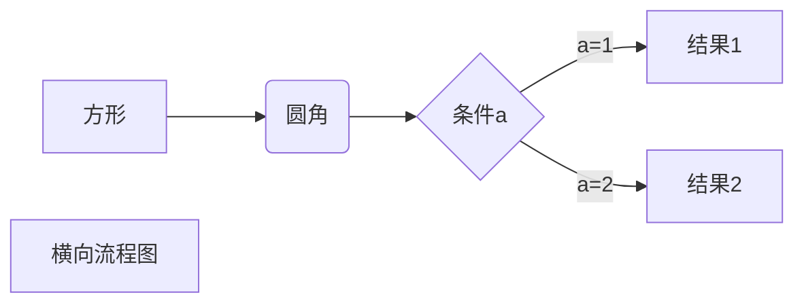

# 你好 :3
确实是想写点什么东西在这里的……  
但是呢  
写不出来！
```cs
var descript = PleaseHelpMeWriteSelfDescription();
try
{
    WriteDownHere(descript);
}
catch
{
    WeiteDownHere("No");
}
```
No  
___
哎，还是没有想写的呢……

来看我的个人主页！  
 B站：[个人主页](https://space.bilibili.com/88753033) [^1]

我平时挺少用 `Markdown` 的，不大会写……不过我看到了一些高级的东西，直接 Ctrl + C 再 Ctrl + V [^2]

```
$$
\begin{Bmatrix}
   a & b \\
   c & d
\end{Bmatrix}
$$
```

$$
\begin{Bmatrix}
   a & b \\
   c & d
\end{Bmatrix}
$$

```
$$
\begin{CD}
   A @>a>> B \\
@VbVV @AAcA \\
   C @= D
\end{CD}
$$
```

$$
\begin{CD}
   A @>a>> B \\
@VbVV @AAcA \\
   C @= D
\end{CD}
$$

```
graph LR
A[方形] -->B(圆角)
    B --> C{条件a}
    C -->|a=1| D[结果1]
    C -->|a=2| E[结果2]
    F[横向流程图]
```



___
__这是我自己写的！__ =v=

$$
\begin{bmatrix}
    a & c \\
    b & d
\end{bmatrix}
\begin{bmatrix}
    x \\
    y
\end{bmatrix}
\=
\begin{bmatrix}
    ax + cy \\
    bx + dy
\end{bmatrix}
$$

[^1]: 嗯嗯纯粹为了显得我会用脚注（
[^2]: 来自[RUNOOB 菜鸟教程](https://www.runoob.com/markdown/md-advance.html)
